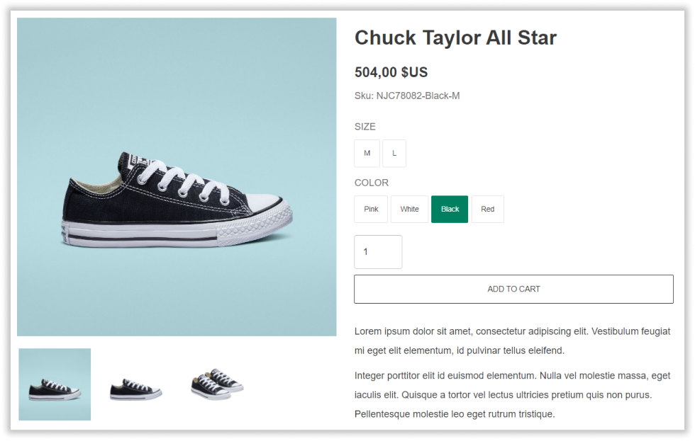

# EverShop – An Open-Source Node Ecommerce Platform Introduction

Welcome to the EverShop. A Node Ecommerce Platform!

EverShop is an open-source [Node ecommerce platform](/) that helps developers developing their e-commerce store. Based on a module system, EverShop is a flexible with both admin panel and front store are extensible.

EverShop also offers rich functionality. Enabling merchants to develop a web store meets the business requirements.

EverShop is free and open-source. The source code is available on [GitHub](https://github.com/evershopcommerce/evershop)

## Technology stack

EverShop's highly modular structure is a result of several open source technologies embedded into a stack. These open source technologies are composed of the following components:

### NodeJS

[Node.js](https://nodejs.org/en/) is an open-source server side runtime environment built on Chrome's V8 JavaScript engine. It provides an event driven, non-blocking (asynchronous) I/O and cross-platform runtime environment for building highly scalable server-side application using JavaScript

### MySQL

[MySQL](https://www.mysql.com/) is a mature and widely used relational database management system (RDBMS) that uses structured query language (SQL). There are both free community versions and commercial versions of MySQL. EverShop requires at least the of MySQL Community Edition version 8.0.

### React

[React](https://reactjs.org/) is a free and open-source front-end JavaScript library for building user interfaces based on UI components. EverShop implements server-side rendering of React components with hydration to provide a fast, performant experience and SEO optimization.

### GraphQL

[GraphQL](https://graphql.org/) is a query language for APIs and a runtime for fulfilling those queries with your existing data. EverShop uses GraphQL and React to build a flexible and extensible front-end.

:::info

Check [this document](/docs/development/getting-started/system-requirements) for more detail about system requirement of EverShop.
:::

## Backend - React Ecommerce Dashboard

Heavy inspired by Shopify, we have a fully-featured admin panel using React that allows you to manage your store.

The admin panel is also designed to be extensible and customizable. Developers can easily add new features to the admin panel without modifying the core source code.

## Front store view - React Graphql Ecommerce 

The EverShop frontend is designed to optimize storefront customization, with highly extensible themes being the central customization mechanism.

:::info
Check out the theme documentation [here](/docs/development/theme/theme-overview).
:::

## Demo store

Explore our demo store.

import Link from '@docusaurus/Link';

<Link
            className="button button--primary button--lg"
            to="https://demo.evershop.io/admin/">
            Admin panel
          </Link>
<Link
            className="button button--primary button--lg"
            to="https://demo.evershop.io/">
            Front store
          </Link>

## Development

EverShop is still in development. We highly welcome any feedback and suggestions.

We invite you to join our [Discord channel](https://discord.com/invite/GSzt7dt7RM) for project discusstion.
