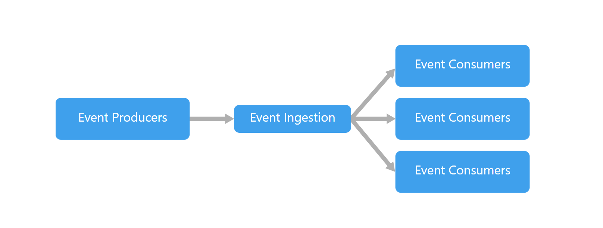

## Overview

In this document, we will learn about the event system in EverShop. EverShop provides a powerful event system that allows you to subscribe to the event and execute your code when the event is triggered.

Events are a way for your application to react to a specific action that occurs. For example, when a product is created, you may want to send an email to the customer. In EverShop, you can subscribe to the `product_created` event and send an email to the customer.

EverShop core can trigger events at different points in the application and your extensions can subscribe to these events and execute your code asynchronously when the event is triggered.

For example, when a product is created, EverShop core will trigger the `product_created` event and your extension can subscribe to this event and execute your code.

## Emitting Events

And event has a name and a data object. This name is used to identify the event and the data object contains the data that will be passed to the event subscribers.

To emit an event, you can use the `event` helper function. This function accepts two parameters: the event name and the data object.

```js title="Emit an event"
import { emitter } from '@evershop/src/lib/event/emitter';

await emitter('product_created', {
    product: {
        id: 1,
        name: 'Product 1'
    }
});
```

Under the hood, an event is stored in the database and the subscribers will be executed asynchronously.

:::info
And event will be removed from the pool when all subscribers are executed regardless of the result of the execution.
:::

## Subscribe to an Event

To subscribe to an event, the first thing you need to do is create a `subscribers` folder in your extension directory. This folder will contain all the subscribers for your extension.

```bash

├── your-extension
│   ├── subscribers
```

Next, create a sub folder with the name of the event you want to subscribe to. For example, if you want to subscribe to the `product_created` event, you need to create a folder with the name `product_created`.

```bash
├── your-extension
│   ├── subscribers
│   │   ├── product_created
```

Next, create a `js` file. This file will contain the code that will be executed when the event is triggered. You can have multiple subscribers for the same event.

```bash
├── your-extension
│   ├── subscribers
│   │   ├── product_created
│   │   │   ├── sendEmail.js
```

Here is an example of a subscriber:

```js title="your-extension/subscribers/product_created/sendEmail.js"
module.exports = async function sendMail(data) {
  // Send email to the customer
}
```

This function will be executed asynchronously when the `product_created` event is triggered. The data object passed to the event will be available in the subscriber function.

:::info
The subscriber function must be a default export.
:::

## List of Events

To be updated